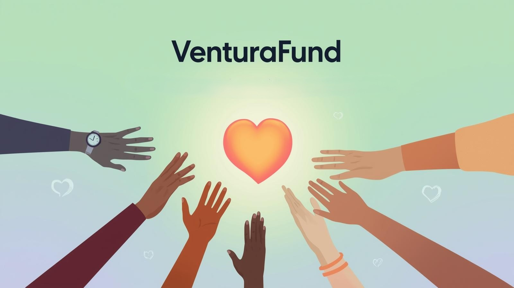

# VenturaFund 💚

**VenturaFund** is a multi-category crowdfunding platform that enables users to create and support campaigns across various causes including Medical, Educational, Business, Emergency needs.

---

## 🌟 Features

- **Multi-Category Support**: Medical, Educational, Business, Emergency, Animal, and Personal campaigns
- **Campaign Management**: Create, browse, and support campaigns with detailed progress tracking
- **Secure Donations**: Integrated payment gateway support (ready for Stripe, PayPal, Razorpay)
- **Responsive Design**: Built with Bootstrap 5 for mobile-first, responsive layouts
- **Milestone-Based Funding**: Transparent fund release based on campaign milestones
- **User Authentication**: Sign-in and registration system
- **Campaign Discovery**: Browse trending and featured campaigns
- **Individual Campaign Pages**: Detailed pages with updates, donations, and organizer info

---

## 🚀 Technologies Used

- **HTML5** - Structure and semantic markup
- **CSS3** - Custom styling and animations
- **Bootstrap 5.3.2** - Responsive grid system and components
- **Font Awesome 6.4.0** - Icons and visual elements
- **Google Fonts (Inter)** - Modern, clean typography
- **JavaScript** - Form handling and interactivity (ready for enhancement)

---

## 📁 Project Structure

VenturaFund/
├── index.html # Homepage
├── signIn.html # Sign-in page
├── signUp.html # Registration page
├── script.js # Javascript
├── donate.html # Universal donation page
├── styles.css # Main stylesheet
├── images/ # Image assets
├── demo/ # Image assets
│ ├── Medical.png
│ ├── Educational Featured.png
│ ├── Business.png
│ ├── Emergency.png
│ ├── Animal.png
│ └── Personal.png
├── categories/
│ ├── medical/
│ │ ├── medicalCampaigns.html
│ │ └── campaigns/
│ │ └── Cancer.html
│ │ └── Dialysis.html
│ │ └── Heart.html
│ │ └── Sarah.html
│ ├── educational/
│ │ ├── educationalCampaigns.html
│ │ └── campaigns/
│ │ ├── SchoolLibrary.html
│ │ ├── STEMLab.html
│ │ ├── Scholarship.html
│ │ └── ArtSupplies.html
│ ├── business/
│ │ ├── businessCampaigns.html
│ │ └── campaigns/
│ │ ├── EcoCafe.html
│ │ ├── MobileBakery.html
│ │ ├── TechStartup.html
│ │ └── JewelryWorkshop.html
│ ├── emergency/
│ │ ├── emergencyCampaigns.html
│ │ └── campaigns/
│ │ ├── FloodRelief.html
│ │ ├── FireRelief.html
│ │ ├── EarthquakeRelief.html
│ │ └── RescueSupport.html
└── start-a-campaign/
└── startCampaign.html
└── storyMedia.html
└── reviewLaunch.html

---

## 🛠️ Installation & Setup

### Prerequisites
- A modern web browser (Chrome, Firefox, Safari, Edge)
- A local web server (optional, for testing)

### Steps

1. **Clone the repository**

git clone https://github.com/RM1338/VenturaFund.git
cd VenturaFund

2. **Open in browser**
- Simply open `index.html` in your browser
- Or use a local server:
  
  Using Python
  python -m http.server 8000
  
  Using Node.js (if you have http-server installed)
  npx http-server
  

3. **Access the site**
- Open `http://localhost:8000` in your browser

---

## 🎨 Customization

### Colors
The primary color scheme can be customized in `styles.css`:

:root {
--primary-color: #2ecc71;
--secondary-color: #27ae60;
}

### Adding New Campaigns
1. Create a new HTML file in the appropriate `campaigns/` folder
2. Follow the existing campaign template structure
3. Update the category listing page to link to your new campaign

---

## 🔮 Future Enhancements

- [ ] Backend integration (Node.js/PHP/Python)
- [ ] Database integration (MongoDB/MySQL)
- [ ] Payment gateway integration (Stripe, PayPal, Razorpay)
- [ ] User authentication and authorization
- [ ] Campaign analytics dashboard
- [ ] Real-time donation tracking
- [ ] Email notifications
- [ ] Social media sharing integration
- [ ] Campaign comments and Q&A section
- [ ] Advanced search and filtering
- [ ] Mobile app (React Native/Flutter)

---

## 📸 Screenshots

### Homepage

### Campaign Listing

### Donation Page

---

## 🤝 Contributing

Currently we are not taking in any contributions as this is our College Project, but you are welcome to clone this Repo and do changes by yourself.

---

## 📄 License

This project is licensed under the MIT License - see the [LICENSE](LICENSE) file for details.

---

## 👥 Authors

- **Ronel Abraham Mathew** - *Landing Page, Start a Campaign Page & UI/UX* - [RM1338](https://github.com/RM1338) | [LinkedIn](https://linkedin.com/in/ronelm)
- **Gavriel Stephen Elijah** - *Sign In/SIgn Up, Categories(Business & Emergency Pages) & Interactive UI(Javascript)* - [gavriel953](https://github.com/gavriel953) | [LinkedIn](https://www.linkedin.com/in/gavriel-stephen-elijah-bb9801361/)
- **Joshua Sibichan Scariya** - *Categories(Medical & Educational Pages)* - [BuildwJoshh](https://github.com/BuildwJoshh) | [LinkedIn](https://www.linkedin.com/in/joshua-sibichan-scariya-141488380/)
- **Sarvesh** - *Research & Donation Page* -  | [LinkedIn](https://www.linkedin.com/in/)

---

## 🙏 Acknowledgments

- Bootstrap team for the amazing framework
- Font Awesome for the comprehensive icon library
- All contributors and supporters of this project

---

## 📞 Contact

For questions or feedback, please reach out:

**Ronel Abraham Mathew**
- Email: rma80070@gmail.com
- GitHub: [@RM1338](https://github.com/RM1338)
- LinkedIn: [Ronel Abraham Mathew](https://linkedin.com/in/ronelm)

**Gavriel Stephen Elijah**
- Email: @gmail.com
- GitHub: [@gavriel953](https://github.com/gavriel953)
- LinkedIn: [Gavriel Stephen Elijah](https://www.linkedin.com/in/gavriel-stephen-elijah-bb9801361/)

**Joshua Sibichan Scariya**
- Email: joshua@gmail.com
- GitHub: [@BuildwJoshh](https://github.com/BuildwJoshh)
- LinkedIn: [Joshua Sibichan Scariya](https://www.linkedin.com/in/joshua-sibichan-scariya-141488380/)

**Sarvesh**
- Email: rma80070@gmail.com
- GitHub: [@](https://github.com/)
- LinkedIn: [Sarvesh](https://linkedin.com/in/)

---

## ⭐ Show Your Support

Give a ⭐️ if this project helped you!

---

**Made with ❤️ by the VenturaFund Team**
